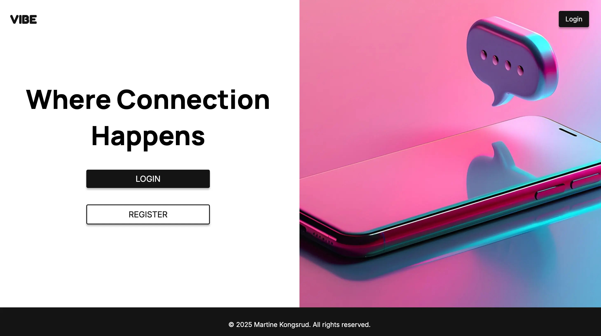

# Vibe Social - JavaScript 2 CA



**Vibe Social** is a social media web application where users can register, log in, create posts with images, edit their content, and interact with other users’ posts. This dynamic and responsive application is built using **JavaScript (ES Modules), HTML, and CSS**, and interacts with the **Noroff Social API** for all backend functionality.

## Description

Vibe Social was created as part of the **JavaScript 2 Course Assignment** at Noroff, showcasing practical skills in modular JavaScript, async/await, API handling, authentication, routing, and dynamic DOM manipulation.

### Features

The website includes the following pages:

- **Home** – Main landing page with options to log in or register.
- **Login** – Allows users to sign into their account.
- **Register** – Enables new users to create an account.
- **Feed** – Displays all posts, posts by followed users, or the user's own posts. Includes search functionality. Users can:
  - View posts in an overlay
  - Click an author's avatar to visit their profile
- **Create Post** – Lets the user create a new post with media.
- **Edit Post** – Allows the user to edit or delete their own posts.
- **Profile** – Displays profile information for any user.
- **Edit Profile** – Lets the user update their own profile details (avatar and bio).

## Built With

- **HTML5**
- **CSS3**
- **JavaScript (ES Modules)**
- **Vite**
- **Noroff Social API**
- **GitHub Pages**

## Getting Started

### Installing

To get a local copy of the project up and running:

1. Clone the repository:

```bash
git clone https://github.com/NoroffFEU/fed2-js2-ca-Martinekong.git
```

2. Install dependencies

```bash
npm install
```

3. Start the local dev server:

```bash
npm run dev
```

4. Build the project

```bash
npm run build
```

5. Preview the production build

```bash
npm run preview
```

## Deployment

This site is deployed using GitHub pages:  
🔗 [Vibe Social website](https://norofffeu.github.io/fed2-js2-ca-Martinekong/)

## Contact

If you have any questions or feedback, feel free to reach out:

- [LinkedIn](https://www.linkedin.com/in/martine-kongsrud)
- Email: [martinekongrus@outlook.com](mailto:martinekongsrud@outlook.com)

## Acknowledgments

Huge thanks to:

- Noroff for providing the project guidelines and Social API
- Teachers for valuable feedback and support.
- Unsplash for the royalty-free hero image
- Vite and GitHub Pages for streamlining the development and deployment process
